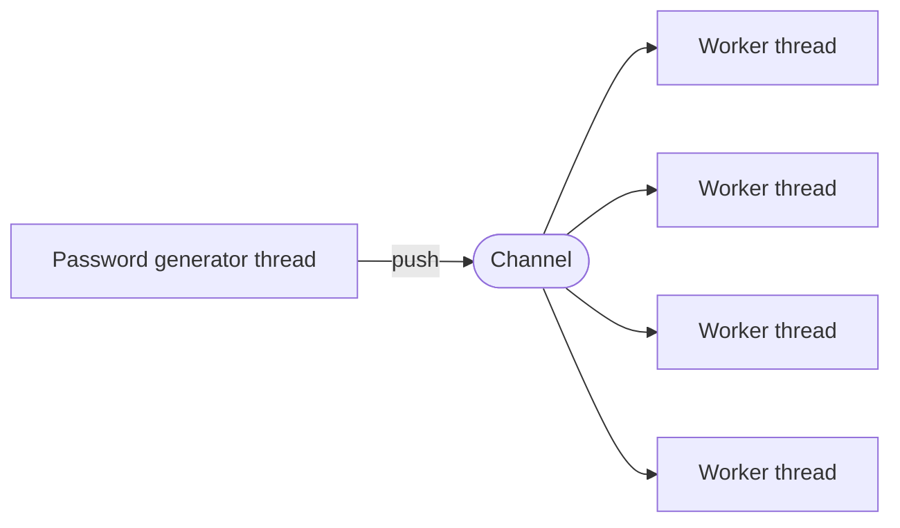

<samp>

# zip-pw-finder

**A password finder for protected ZIP files using a brute force strategy**

</samp>

## Architecture

## Dependencies

- [crossbeam-channel](https://github.com/crossbeam-rs/crossbeam)
- [zip-rs](https://github.com/zip-rs/zip)
- [indicatif](https://github.com/console-rs/indicatif)
