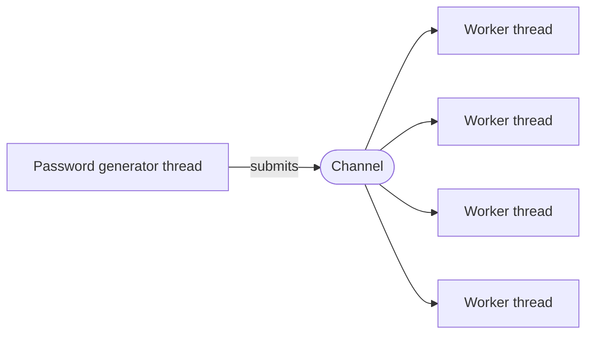

<samp>

# zip-password-finder

**A password finder for protected ZIP files using a brute force strategy**

</samp>

## Architecture

```mermaid
graph LR;

A[Password generator thread]
B([Channel])
1[Worker thread]
2[Worker thread]
3[Worker thread]
4[Worker thread]

A -->|submits| B
B --> 1
B --> 2
B --> 3
B --> 4
```
